# Reinforcement Learning Atari Agent
### xieruishen & barlowr

## Blog Post 1: Q Learning Reinforcement Model

#### 11/22/20 (Rob)

Back in 2013, DeepMind published the paper, *"Playing Atari with Deep Reinforcement Learning,"* which illustrated how a convolutional neural network could be trained with a variant of Q-Learning to play Atari video games. We hope to be able to replicate this result, and this page will follow the development progress of a deep RL agent to play Atari videogames.

As a first step, we read the first 3 chapters of [this book](http://incompleteideas.net/book/RLbook2020.pdf) and implemented a RL agent to  play both Tic Tac Toe and Mancala. The agent is fairly simple; at any given state, a random draw with probability epsilon is made to decide whether to take a random valid action, or to take an action that optimizes the chances of winning based on an internal graph of rewards (The Q graph). The state is then updated based on the action and the action of the opponent, and another draw is made for the new state. When the game reaches completion, a reward, based on whether the agent won or lost, is then back propagated through the graph of the prior state action pairs to map out the probability of reward given each action at each state, Q. This graph is populated by playing the game, so over time the agent gets better and better at maximizing the reward over time.

Below I've included a few different plots of the win percentage of the RL agent and the number of state action pairs mapped over time, with our agent playing against an opponent who makes simple moves. I've included a few different values for epsilon, to show the effect that it has on the number of state-action pairs mapped and the success of the agent.

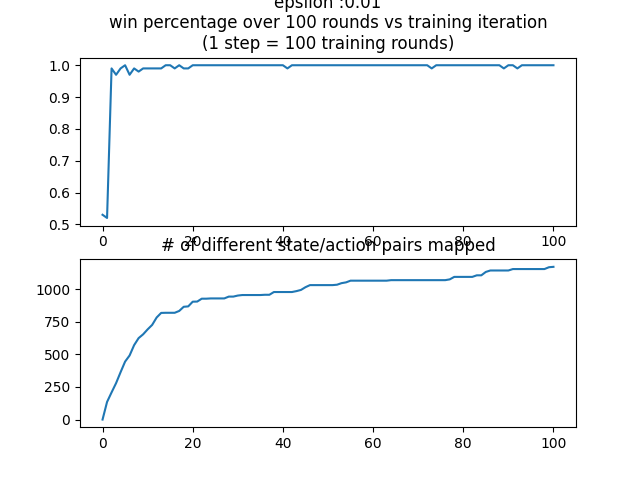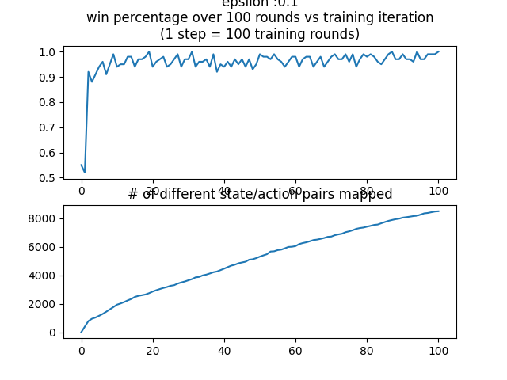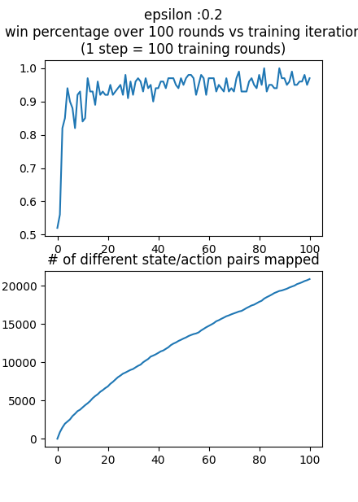

Each agent was trained 10000 times, and the win percentage and states mapped were calculated every 100 training iterations using a test of 100 games. As one could predict, a higher epsilon results in many, many more state/action pairs mapped, but does not win as often as a lower epsilon. In a more complex environment or against a more intelligent AI, it is likely that a higher number of states mapped would contribute much more to the win percentage, but against this simple AI, it doesn't take long for the agent with epsilon 0.01 to find a path through the graph that leads to a win and exploit that path for a very high win percentage, despite a low number of state-action pairs mapped.

In implementing this agent, I accidentally introduced an interesting bug into the system. I wasn't taking into account the number of times a node in the reward graph had been previously updated, so nodes leading to more explored areas had a arbitrarily high Q value. This would lead to the agent choosing not simply to follow the path that lead to the highest probability of high reward, but to follow the path that had the highest number of mapped positive reward end states.  This might be an useful variation on the model, but it didn't lead to success in Mancala; below is the plot of the win percentage of this bugged version of the agent (compare this to the win percentage over time of the above plot with epsilon = 0.2). Note that the title is wrong; in this plot, 1 step = 1000 training rounds, which accounts for the increased magnitude of state/action pairs mapped.

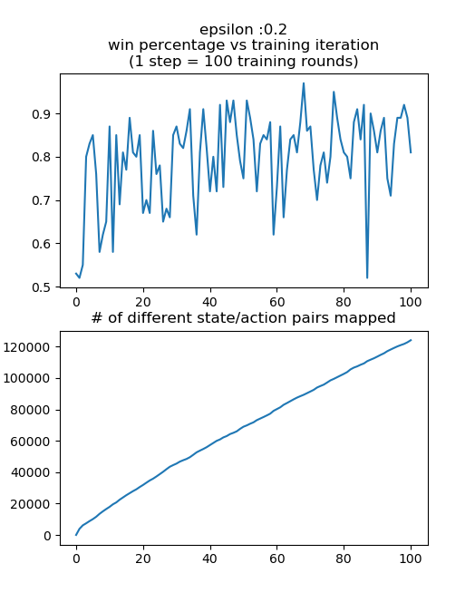

#### 11/22/20 - 11/23/20 (Sherrie)
[Link](https://colab.research.google.com/drive/1yQbzTMDOjbsEC-VppzQcCXTNocpRDZl7)  to full Google Collab Notebook.

Additionally, I implemented a path finding agent using Reinforcement Learning following this [tutorial](https://towardsdatascience.com/implement-grid-world-with-q-learning-51151747b455). Intially, the RL agenet was able to find the most optimal path in a simple 2x3 grid with one obstacle very quickly with less than 10 rounds. As I scaled up the grid environment and increase the complexity of the obstacle, I have encountered the following problem:
* Each round takes too long as I allow the agent to take an action that will go off bound of the grid world. Even though the agenet will never be in such state, but it wastes significantly amount of runtime for the agenet to consider such action as even viable.
* The reward function was too simple as it only assign a positive reward to the goal state and negative reward to going into the obstacle position. What happened was when there is no adjacent obstacle but there are obstacles within two or three rows/columns, the agent often got stuck in going back an forth between two states as it does not prioritize actions that will leads itself closer to the goal.
* Sometimes in the presence of complex obstacles like corners and long walls, the agent gets stuck around the obstacle.

To address the above problems, I have tried the following:
* When I first initilialize the Q table, I give all state-action pair that will leads to an off bound position a value of negative infinity. Additionally, when choosing which action to take, the agent will also avoid actions that will drive it into an off grid position. The effect is drastic. The new runtime of 300 rounds is equivalent to the old runtime of 15 rounds.
* I increase the complexity of the reward function to consider the Manhattan distance of the current position and the next position. An action that will move the agent closer to the goal will yield high reward than one that will move the agent farther from the goal. This change allows the agent to reach the end goal faster and avoid getting stuck when there is no adjacent obstacles.
* To address the problem of agent getting stuck around obstacles, there is no direct strategy but tweeking the reward assigned to getting into an obstacle state, tuning the explore vs exploit rate and increasing the number of rounds for the agent to play.

The final result of training an RL agent for 300 rounds to find the optimal path in a 15x15 grid world with relatively complex obstacles is shown below.

Grid World (left) & Optimal Path(right):

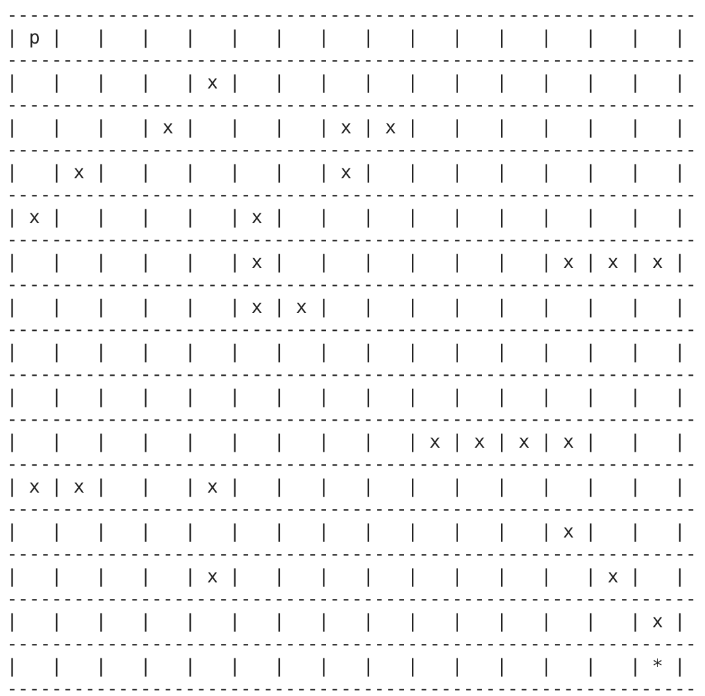 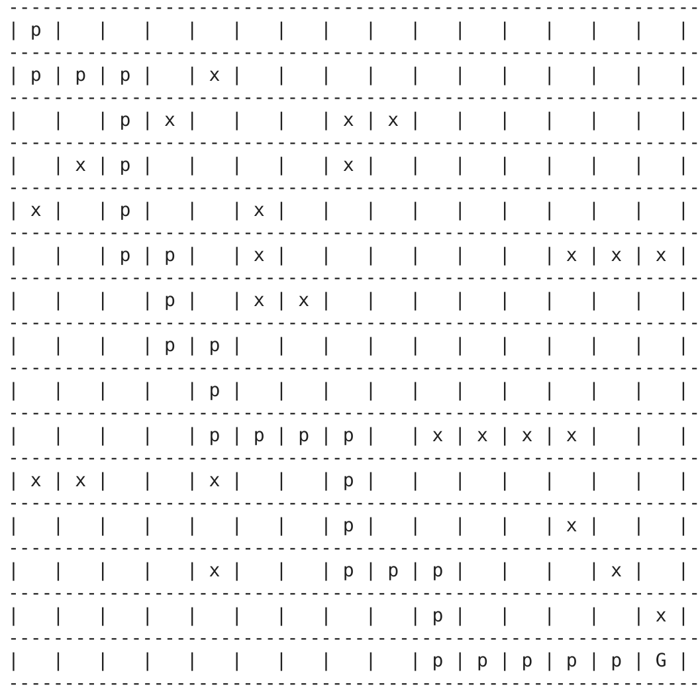

Runtime(seconds) per Round (left) & Total Number of Explored States per Round(right):
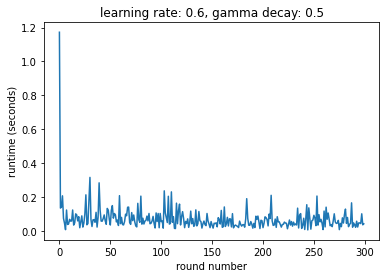 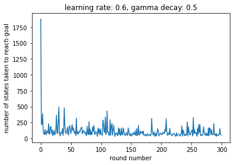

### Blog 1.1

##### 11/23 (Rob)

In class today, I decided to implement a way to play against the RL agent in Mancala. I threw together a bit of a hack-y interface for user actions, and I trained two RL agents against each other for 100000 cycles before attempting to beat one of the agents at the game. More often than not however, instead of winning or losing, I found myself at a previously unmapped state. This seemed pretty bizarre to me, as the agent had mapped 130000+ state action pairs, but given the 48 stones in the game of Mancala and the 14 different pockets, I imagine that there are still hundreds of thousands of unmapped state-action pairs (note how the last graph in Blog 1 doesn't seem to show much curvature; given more iterations, the algorithm will likely continue to map out more and more state/action pairs).

By the time the algorithm had mapped out all of these state action pairs, my computer was running very low on available RAM. Granted, Python isn't the most efficient of languages, but I couldn't continue to keep adding pairs to the graph. This limitation exists even though I kept finding unmapped states while playing against the agent; it wasn't like the algorithm had mapped all the useful states and was filling the memory with esoteric ones.

This highlights what could be one of the advantages of deep Q learning; constant memory space. In a environment with many, many more state inputs, it would be nearly impossible to build a Q graph of all of the state action pairs. With a neural network, even if the network is very large, it has a constant size; training it doesn't require more memory.

### Blog 2

##### 12/9 (Rob)

Following the fantastic guides [here](https://medium.com/@ts1829/policy-gradient-reinforcement-learning-in-pytorch-df1383ea0baf) and [here](https://towardsdatascience.com/learning-reinforcement-learning-reinforce-with-pytorch-5e8ad7fc7da0), I wrote a policy gradient deep RL model.  The model self initializes based off of a provided OpenAI Gym Environment type, and uses a sequential network. The first layer is a linear layer with the provided input size and 16 output nodes, followed by a rectified linear unit, then another linear layer with 16 inputs and n outputs, where n is the number of possible discrete actions in the environment. Finally, the output of that linear layer is fed through a softmax layer to collapse the output into probabilities of each action (I.E. 0.7 for left and 0.3 for right, or 0.2 for 1, 0.4 for 2 and 0.4 for 3, depending on the possible actions).

While Q Learning works to approximate a Q function using a NN, the Policy Gradient approach seeks to directly optimize in the policy space. Concretely, the policy gradient network directly outputs action probabilities given the current state, while Q learning outputs a likelihood of probable future reward for each action given the current state. I chose to write my model as a policy gradient network as [it has been show](https://arxiv.org/abs/1602.01783) that policy gradients work better than DQN when tuned well. Policy gradients are also considered to be more widely applicable, especially in situations where the Q function is too complex to be learned.

If you want to dive into the code, the policy gradient module can be found [here](./src/policy_gradient/policy_gradient.py)! Now on to the results.

I initially trained this model on the OpenAi Gym Cartpole environment, but the space there isn't very complex and the visualization isn't too interesting, so I switched to the Lunar Lander environment. In this environment, a vehicle is initialized with random position and velocity above a randomly generated "lunar surface," and the agent can engage left, right and center rocket thrusters to guide the vehicle to a goal landing zone. Rewards are constantly given based on proximity to the landing zone, and the vehicle is penalized for using the engines (wasting fuel) and for crash landing. A final reward is given if the vehicle lands in the goal zone and shuts down the engines completely.

I trained this model for an hour on 21000 episodes,  but the agent converged after about 15 minutes and 7000 episodes. Figure 1 shows a plot of average agent reward over the past 100 episodes vs # of episodes trained, and a plot of cumulative time taken to train vs # of episodes trained. Note the shift in slope around episode 4000; This is likely when the agent learned to maintain a "hover" using the engines, which means that each episode takes longer to compute, as the agent isn't just falling out of the sky and ending the episode. Because the agent can theoretically hover forever, I capped the number of frames in an episode to 400 to decrease computational time. I had initially tried 1000, but that took far too long to compute given the number of episodes I was training on.

I've also included a few gifs of the progress of the agent as it learned to land. Figure 2 shows the agent with no training, Figure 3 shows the agent with 9000 episodes of training, and Figure 4 shows the agent at the end of the training at 21000 episodes.

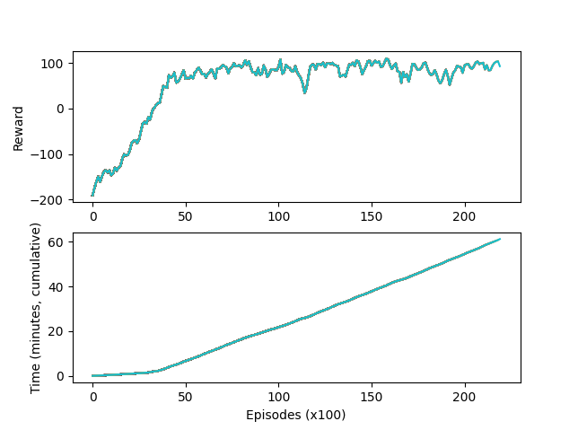

#### *Figure 1: Training Progress*  
\
\

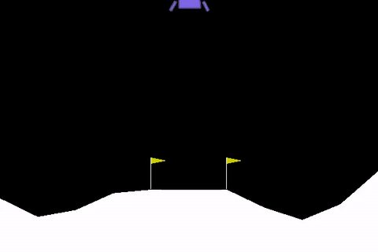

#### *Figure 2: No Training*  
\
\

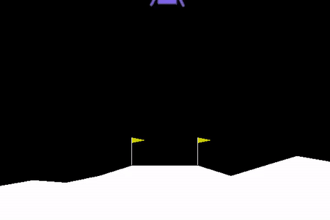

#### *Figure 3: 9000 Episodes*  
\
\

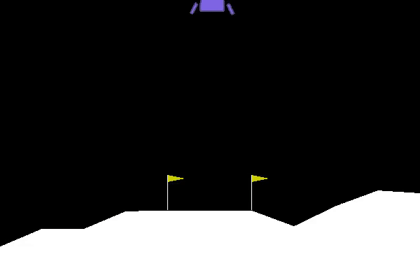

#### *Figure 4: 21000 Episodes*  
\
\

As a final note, a perceptive eye will notice that even after 21000 episodes, the agent doesn't actually "land"; it hovers above the goal and touches down for a moment, but doesn't shut down the engine and receive the final, very high reward. I'm interested in trying to achieve this goal, but I was hoping to decrease the computational time of the model before training it further. My vanilla policy gradient model all works on a single cpu process, so each episode is computed sequentially. Calculating the episodes takes much longer than training the model, so this sequential computation of episodes is the current bottleneck. Instead of training after each episode, the vanilla implementation computes batches of episodes, aggregates the states, actions and rewards from all episodes in the batch, then computes the loss and gradient from these batches of data, so as to avoid altering the model too much.

It would seem to me that I could easily speed this up by computing each episode in the batch on a separate, parallel process to utilize all 12 cores in my pc instead of computing sequentially on a single core. I rewrote the model to use python multiprocessing "Pool", but I haven't had much success getting it to work correctly; the model trains, but has very strange behavior. Sometimes it will seem to optimize for low reward, other times it will get to a medium reward and sit there for a thousand episodes and then drop off. Interestingly enough, I can run the same exact code without the Pool functionality,  and it works fine. I think it might have something to do with the way that Pool interacts with PyTorch, but I don't know enough about either under the hood to know why it doesn't work.

##### 12/9 (Sherrie) Failed DQN with convolutional layers for Mountain Car

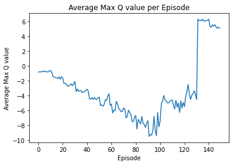
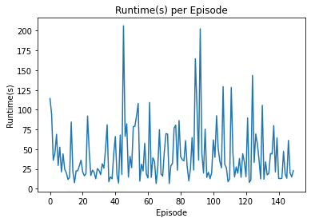

