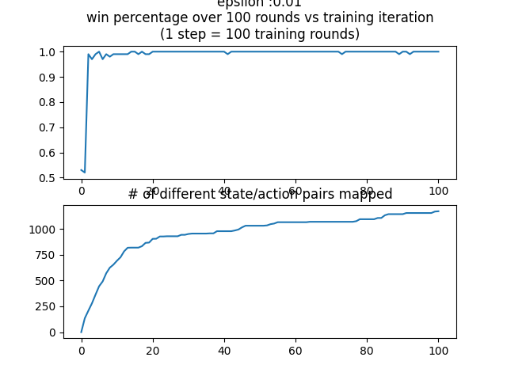
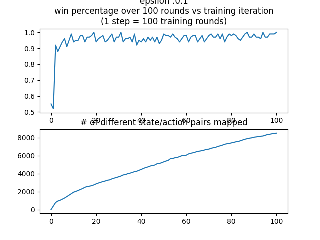
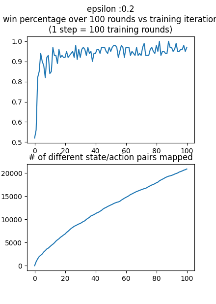
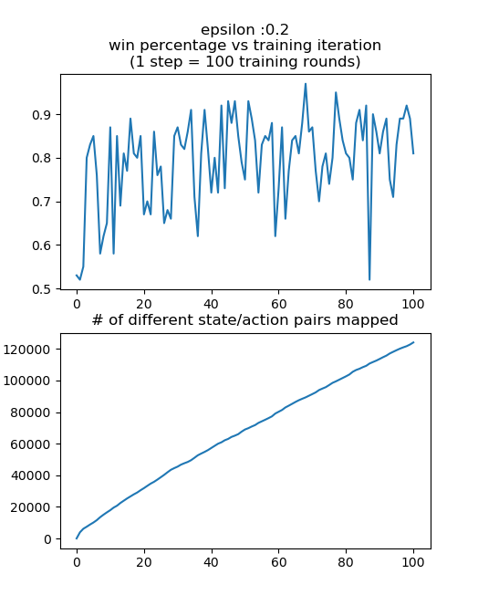

# Reinforcement Learning Atari Agent
### xieruishen & barlowr

## Blog Post 1: Q Learning Reinforcement Model

###### 11/22/20 (Rob)

Back in 2013, DeepMind published the paper, *"Playing Atari with Deep Reinforcement Learning,"* which illustrated how a convolutional neural network could be trained with a variant of Q-Learning to play Atari video games. We hope to be able to replicate this result, and this page will follow the development progress of a deep RL agent to play Atari videogames. 

As a first step, we read the first 3 chapters of [this book](http://incompleteideas.net/book/RLbook2020.pdf) and implemented a RL agent to  play both Tic Tac Toe and Mancala. The agent is fairly simple; at any given state, a random draw with probability epsilon is made to decide whether to take a random valid action, or to take an action that optimizes the chances of winning based on an internal graph of rewards (The Q graph). The state is then updated based on the action and the action of the opponent, and another draw is made for the new state. When the game reaches completion, a reward, based on whether the agent won or lost, is then back propagated through the graph of the prior state action pairs to map out the probability of reward given each action at each state, Q. This graph is populated by playing the game, so over time the agent gets better and better at maximizing the reward over time. 

Below I've included a few different plots of the win percentage of the RL agent and the number of state action pairs mapped over time, with our agent playing against an opponent who makes simple moves. I've included a few different values for epsilon, to show the effect that it has on the number of state-action pairs mapped and the success of the agent.

Each agent was trained 10000 times, and the win percentage and states mapped were calculated every 100 training iterations using a test of 100 games. As one could predict, a higher epsilon results in many, many more state/action pairs mapped, but does not win as often as a lower epsilon. In a more complex environment or against a more intelligent AI, it is likely that a higher number of states mapped would contribute much more to the win percentage, but against this simple AI, it doesn't take long for the agent with epsilon 0.01 to find a path through the graph that leads to a win and exploit that path for a very high win percentage, despite a low number of state-action pairs mapped. 

In implementing this agent, I accidentally introduced an interesting bug into the system. I wasn't taking into account the number of times a node in the reward graph had been previously updated, so nodes leading to more explored areas had a arbitrarily high Q value. This would lead to the agent choosing not simply to follow the path that lead to the highest probability of high reward, but to follow the path that had the highest number of mapped positive reward end states.  This might be an useful variation on the model, but it didn't lead to success in Mancala; below is the plot of the win percentage of this bugged version of the agent (compare this to the win percentage over time of the above plot with epsilon = 0.2). Note that the title is wrong; in this plot, 1 step = 1000 training rounds, which accounts for the increased magnitude of state/action pairs mapped.

### Blog 1.1

##### 11/23 (Rob)

In class today, I decided to implement a way to play against the RL agent in Mancala. I threw together a bit of a hack-y interface for user actions, and I trained two RL agents against each other for 100000 cycles before attempting to beat one of the agents at the game. More often than not however, instead of winning or losing, I found myself at a previously unmapped state. This seemed pretty bizarre to me, as the agent had mapped 130000+ state action pairs, but given the 48 stones in the game of Mancala and the 14 different pockets, I imagine that there are still hundreds of thousands of unmapped state-action pairs (note how the last graph in Blog 1 doesn't seem to show much curvature; given more iterations, the algorithm will likely continue to map out more and more state/action pairs). 

By the time the algorithm had mapped out all of these state action pairs, my computer was running very low on available RAM. Granted, Python isn't the most efficient of languages, but I couldn't continue to keep adding pairs to the graph. This limitation exists even though I kept finding unmapped states while playing against the agent; it wasn't like the algorithm had mapped all the useful states and was filling the memory with esoteric ones. 

This highlights what could be one of the advantages of deep Q learning; constant memory space. In a environment with many, many more state inputs, it would be nearly impossible to build a Q graph of all of the state action pairs. With a neural network, even if the network is very large, it has a constant size; training it doesn't require more memory. 