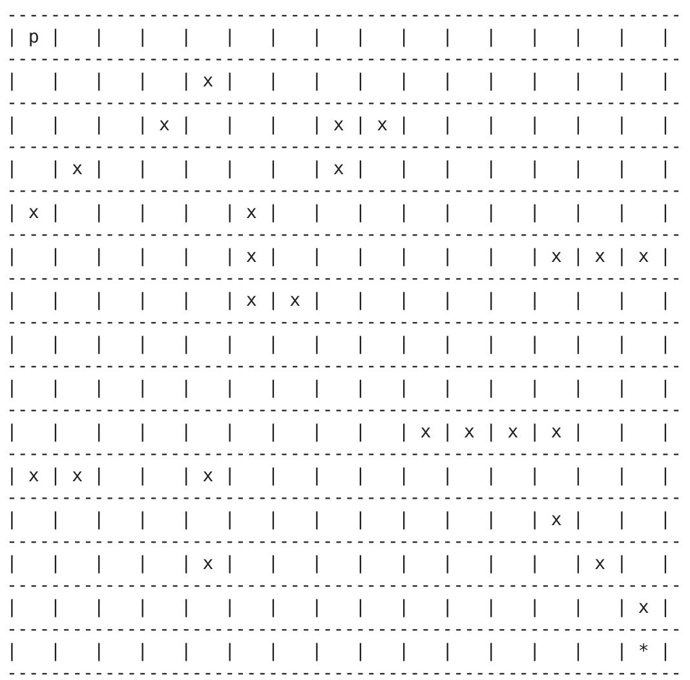
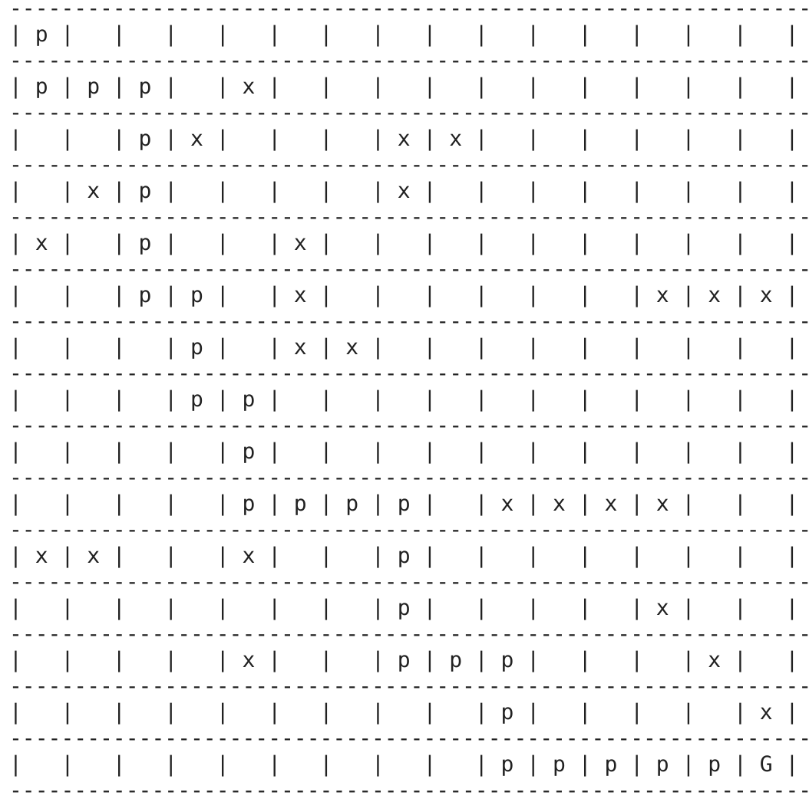
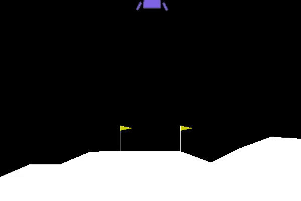

# Applications of Deep Reinforcement Learning
## Project Description

## Motivation
Reinforcement learning is a topic applicable to many, many problems in computer science and in robotics. We are interested in taking a broad survey of the field and focusing in on deep reinforcement learning. We hope to learn as much about the topic as we can in the time given, and use that knowledge to implement a deep RL agent to optimize reward in increasingly complex environments, culminating with an Atari game.

## Mathematical Concepts

### Q Learning
Q-Learning is a method used to map out reward spaces in a finate markov chain environment.

Bellman Equation: [Source](https://www.freecodecamp.org/news/an-introduction-to-q-learning-reinforcement-learning-14ac0b4493cc/)

The Q Learning agent learns an action-value function, Q, which directly approximates q⇤, the optimal action-value functionfor the environment.  
At any given state, a random draw with probability epsilon is made to decide whether to take a random valid action, or to take an action that optimizes the chances of winning based on an internal graph of rewards (The Q graph). The state is then updated based on the action and the action of the opponent, and another draw is made for the new state. When the game reaches completion, a reward, based on whether the agent won or lost, is then back propagated through the graph of the prior state action pairs to map out the probability of reward given each action at each state, Q. This graph is populated by playing the game, so over time the agent gets better and better at maximizing the reward over time.

## Implementation
### Tic Tac Toe and Mancala
See [Blog post 1](./blog.md)

### Path Finding

#### System Architecture

#### Result
[Link](https://colab.research.google.com/drive/1yQbzTMDOjbsEC-VppzQcCXTNocpRDZl7)  to full Google Collab Notebook.

### Deep Q Learning with Experience Replay
### Deep Q Network

### [Mountain Car](https://gym.openai.com/envs/MountainCar-v0/)
The implementation of training an RL agent to play mountain car using DQN can be found in this [Google Colab Notebook](https://colab.research.google.com/drive/1sbthl71ECC5GGnlbgaBz0J_SpBhgmY_N?usp=sharing).
#### System Architecture

#### Result

##### Training 151th episode

##### Reward Tuning

##### Testing

### Policy Gradients
While Q Learning works to approximate a Q function using a NN, the Policy Gradient approach seeks to directly optimize in the policy space. Concretely, the policy gradient network directly outputs action probabilities given the current state, while Q learning outputs a likelihood of probable future reward for each action given the current state. I chose to write my model as a policy gradient network as [it has been show](https://arxiv.org/abs/1602.01783) that policy gradients work better than DQN when tuned well. Policy gradients are also considered to be more widely applicable then DQNs, especially in situations where the Q function is too complex to be learned.

### [Lunar Lander](https://gym.openai.com/envs/LunarLander-v2/)
This environment is a simulated "lunar landing," where the agent is tasked with landing a vehicle on a randomized "surface of the moon" using 3 engines. This is a standard environment in the OpenAi gym, and information about the reward schema can be found at the link above.  
One important note: to speed up training time, I limited the length of episodes from 1000 frames to 400 frames. This is still plenty of time for the agent to land, but cuts down on unproductive time spent hovering above the lunar surface.
#### System Architecture
The lunar lander policy network is a feed forward network made up of a num_input->16 linear layer, a rectified linear unit layer, a 16->num_output linear layer and finally a softmax function. The network is reinforced using a Adam optimization function, with loss calculated as the reward|(action, state) * P(action|state).  

#### Result
Hyperparameters are as follows:  
*Learning rate:* 0.001  
*Gamma*: 0.999  
*Batch size*: 2

This agent converged to a reward of ~100 after roughly 9000 episodes. Further training did improve the model, but only slightly.  Below is a gif of the agent landing the vehicle after 21000 training episodes; for more discussion on the results of this model, see [blog post 2](./blog.md)

### Atari Brickbreaker
Atari Brickbreaker is the classic example from Deepmind's seminal 2013 paper on Deep Reinforcement Learning. The game is ubiquidous; Google even turned their image search into an atari breakout game for the it's 37th anniversary (which happened to coincide with the year the Deepmind paper was published). We attempted to train a policy gradient agent to play this classic game.
#### System Architecture
The first step in this model is preprocessing of the images from the OpenAi gym emulator. The Atari game provides a 210 × 160 pixel image with full color, which we greyscale and downsample to 105x80. Next we crop the image to 80x80. 4 sequential images are stacked and used as input for the policy network.
The Atari policy network is the same as the one used in Deepmind's paper. From the paper: "The first hidden layer convolves 16 8 × 8 filters with stride 4 with the input image and applies a rectifier nonlinearity. The second hidden layer convolves 32 4 × 4 filters with stride 2, again followed by a rectifier nonlinearity. The final hidden layer is fully-connected and consists of 256 rectifier units. The output layer is a fullyconnected linear layer with a single output for each valid action." We have added on a Softmax function as a final step.
#### Result
One of our implementation of training RL agent to play Breakout with DQN can be viewed in this [Google Collab Notebook](https://colab.research.google.com/drive/1k_Kx8ax5jTcOy3BkU5FgZZFeSLa1Gped?usp=sharing).

Unfortunately, we haven't been able to get this agent to train. One downside to Deep Reinforcement learning is the sensitivity of models to hyperparameters, and we haven't been able to find a combination of parameters that work well. I've found that too high of a learning rate results in a unstable model whose loss function exponentially increases, but too low of a learning rate doesn't seem to minimize the loss function over time. Below is a plot of the reward of the model with a learning rate of 0.00003; even given 8 hours to train over ~32000 episodes, the model doesn't improve at all.

## Reflection

### Next Steps
