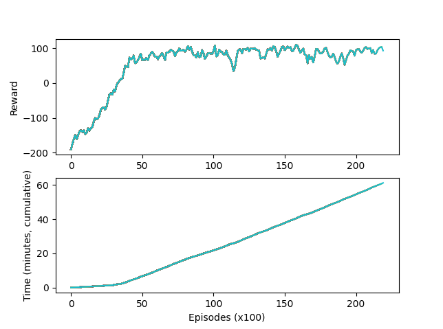

---
title: Home
layout: template
filename: home
--- 

# Applications of Deep Reinforcement Learning
## Project Description

## Motivation
Reinforcement learning is a topic applicable to many, many problems in computer science and in robotics. We are interested in taking a broad survey of the field and focusing in on deep reinforcement learning. We hope to learn as much about the topic as we can in the time given, and use that knowledge to implement a deep RL agent to optimize reward in increasingly complex environments, culminating with an Atari game. 

## Mathematical Concepts

### Q Learning

## Implementation
### Tic Tac Toe and Mancala
#### System Architecture
#### Result 
link to blog post section
### Path Finding
#### System Architecture
#### Result
link to blog post section 

### Deep Q Learning with Experience Replay
### Deep Q Network

### Cartpole and/or Mountain Car
#### System Architecture
#### Result

### Policy Gradients
While Q Learning works to approximate a Q function using a NN, the Policy Gradient approach seeks to directly optimize in the policy space. Concretely, the policy gradient network directly outputs action probabilities given the current state, while Q learning outputs a likelihood of probable future reward for each action given the current state. I chose to write my model as a policy gradient network as [it has been show](https://arxiv.org/abs/1602.01783) that policy gradients work better than DQN when tuned well. Policy gradients are also considered to be more widely applicable then DQNs, especially in situations where the Q function is too complex to be learned. 

### [Lunar Lander](https://gym.openai.com/envs/LunarLander-v2/)
This environment is a simulated "lunar landing," where the agent is tasked with landing a vehicle on a randomized "surface of the moon" using 3 engines. This is a standard environment in the OpenAi gym, and information about the reward schema can be found at the link above.  
One important note: to speed up training time, I limited the length of episodes from 1000 frames to 400 frames. This is still plenty of time for the agent to land, but cuts down on unproductive time spent hovering above the lunar surface. 
#### System Architecture
The lunar lander policy network is a feed forward network made up of a num_input->16 linear layer, a rectified linear unit layer, a 16->num_output linear layer and finally a softmax function. The network is reinforced using a Adam optimization function, with loss calculated as the reward|(action, state) * P(action|state).  

#### Result
Hyperparameters are as follows:  
*Learning rate:* 0.001  
*Gamma*: 0.999  
*Batch size*: 2 

This agent converged to a reward of ~100 after roughly 9000 episodes. Further training did improve the model, but only slightly.  Below is a gif of the agent landing the vehicle after 21000 training episodes; for more discussion on the results of this model, see [blog post 2]{{blog}}

## Reflection
### Challenges
### Next Steps

documentation requirement:
Show it off: Describe the main idea of your project. What does your system do? Why would you want to do this? What are the major components to your system and how do they fit together? Hopefully you will have some cool videos to put in the website by this point.
System architecture: In detail describe each component of your project. Make sure to touch upon both code structure as well as algorithms.
